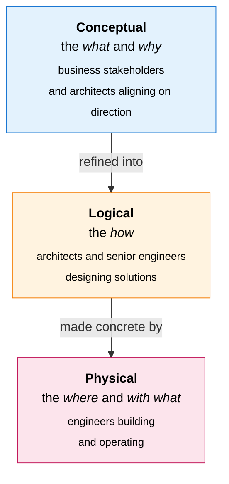

# Abstraction Layers

Every architecture domain is modelled at three layers of abstraction. Every artefact type lives at exactly one layer.

| Layer | Folder | Description | Audience |
|---|---|---|---|
| **Conceptual** | `conceptual/` | The *what* and *why*. Technology-agnostic models that capture intent, scope, and business context. | Business stakeholders and architects aligning on direction |
| **Logical** | `logical/` | The *how*. Vendor-neutral models that define structure, relationships, and rules without committing to specific products or infrastructure. | Architects and senior engineers designing solutions |
| **Physical** | `physical/` | The *where* and *with what*. Concrete, implementation-specific models tied to actual products, platforms, and environments. | Engineers building and operating the architecture |

The layers are progressive: Logical artefact types realise Conceptual ones; Physical artefact types realise Logical ones. Cross-layer relationships are captured in **Matrix** artefact types (see [output-formats.md](output-formats.md)).
