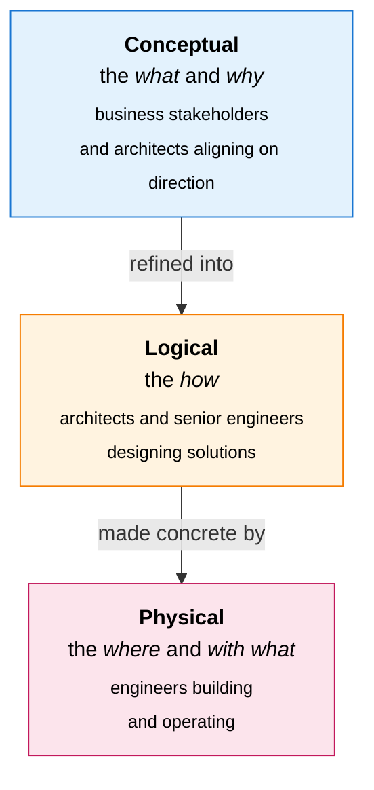

# Abstraction Layers

Every architecture domain is modelled at three levels of detail. Every artefact type sits at exactly one level.

| Layer | Description | Audience |
|---|---|---|
| **Conceptual** | The *what* and *why*. Sets direction and intent — what the architecture needs to achieve and why, without any technology choices. | Business stakeholders and architects aligning on direction |
| **Logical** | The *how*. Defines the rules and principles that guide design decisions, without committing to any specific tool or product. | Architects and senior engineers designing solutions |
| **Physical** | The *where* and *with what*. Specifies the concrete standards and technology decisions that govern how the architecture is built and operated. | Engineers building and operating the architecture |

The layers are progressive: Logical artefacts build on Conceptual ones; Physical artefacts make Logical ones concrete. Relationships that cross layers are captured in **Matrix** artefact types (see [output-formats.md](output-formats.md)).
