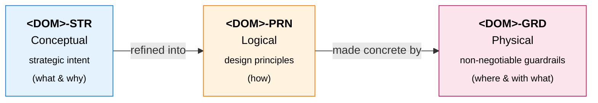

# Artefact Types

An **artefact type** is a single, classified piece of architecture content. Every artefact type:

- Is aligned to exactly one [architecture domain](domains.md)
- Is aligned to exactly one [abstraction layer](abstraction-layers.md)
- Conforms to exactly one [output format](output-formats.md)
- Has a unique ID prefixed with the architecture domain acronym (e.g. `BUS-CAP`, `APP-DAP`)

Each artefact type has a folder under `architectures/clients/<client>/<version>/artefacts/domains/<domain>/<layer>/<ID>/` containing its instance data. Catalogues are backed by a JSON Schema at the matching path under `config/schemas/`.

## Cross-domain baseline (Strategy / Principles / Guardrails)

Every architecture domain carries three artefact types that capture the abstraction-layer semantics directly:

- **`<DOM>-STR`** (Conceptual) — strategic intent; the *what* and *why*
- **`<DOM>-PRN`** (Logical) — design principles; the *how*
- **`<DOM>-GRD`** (Physical) — non-negotiable guardrails; the *where* and *with what*

The shapes are shared across all five architecture domains (so all five `<DOM>-STR` schemas have the same fields, just domain-specific examples), but each domain has its own schema doc page with a domain-specific example. See the matrix in [schemas/index.md](schemas/index.md).

## Registry

This table is the authoritative registry of every defined artefact type. The schema-only index at [`/config/schemas/artefacts.json`](../config/schemas/artefacts.json) covers just the catalogues.

| ID | Architecture Domain | Abstraction | Format | Name | Description |
|---|---|---|---|---|---|
| BUS-STR | Business | Conceptual | Catalogue | Business Strategy | Outcome-oriented strategic statements for the Business domain — the what and why at the highest level |
| BUS-CAP | Business | Conceptual | Catalogue | Business Capabilities | Hierarchical catalogue of what the business does, independent of how it does it |
| BUS-BCM | Business | Conceptual | Diagram | Business Capability Model | Visual map of the Business Capabilities Catalogue (BUS-CAP) |
| BUS-PRO | Business | Conceptual | Catalogue | Business Processes | Hierarchical catalogue of sequences of activities that deliver business value |
| BUS-BPM | Business | Conceptual | Diagram | Business Process Model | Visual flow of the Business Processes Catalogue (BUS-PRO) |
| BUS-PRN | Business | Logical | Catalogue | Business Principles | Vendor-neutral guidelines that shape design decisions in the Business domain |
| BUS-GRD | Business | Physical | Catalogue | Business Guardrails | Non-negotiable constraints and mandatory standards for the Business domain |
| DAT-STR | Data | Conceptual | Catalogue | Data Strategy | Outcome-oriented strategic statements for the Data domain |
| DAT-DAC | Data | Conceptual | Catalogue | Data Domains & Concepts | Two-tier catalogue of data subject areas and the conceptual data entities they contain |
| DAT-CDM | Data | Conceptual | Diagram | Conceptual Data Model | Visual model of the Data Domains & Concepts Catalogue (DAT-DAC) |
| DAT-PRN | Data | Logical | Catalogue | Data Principles | Vendor-neutral guidelines that shape design decisions in the Data domain |
| DAT-GRD | Data | Physical | Catalogue | Data Guardrails | Non-negotiable constraints and mandatory standards for the Data domain |
| INT-STR | Integration | Conceptual | Catalogue | Integration Strategy | Outcome-oriented strategic statements for the Integration domain |
| INT-PRN | Integration | Logical | Catalogue | Integration Principles | Vendor-neutral guidelines that shape design decisions in the Integration domain |
| INT-GRD | Integration | Physical | Catalogue | Integration Guardrails | Non-negotiable constraints and mandatory standards for the Integration domain |
| APP-STR | Application | Conceptual | Catalogue | Application Strategy | Outcome-oriented strategic statements for the Application domain |
| APP-DAP | Application | Logical | Catalogue | Application Domains & Platforms | Two-tier catalogue of application groupings and the platforms that sit within them |
| APP-DPM | Application | Logical | Diagram | Domains & Platforms Model | Visual map of the Application Domains & Platforms Catalogue (APP-DAP) |
| APP-PRN | Application | Logical | Catalogue | Application Principles | Vendor-neutral guidelines that shape design decisions in the Application domain |
| APP-GRD | Application | Physical | Catalogue | Application Guardrails | Non-negotiable constraints and mandatory standards for the Application domain |
| SOL-STR | Solution | Conceptual | Catalogue | Solution Strategy | Outcome-oriented strategic statements for the Solution domain |
| SOL-PRN | Solution | Logical | Catalogue | Solution Principles | Vendor-neutral guidelines that shape design decisions in the Solution domain |
| SOL-GRD | Solution | Physical | Catalogue | Solution Guardrails | Non-negotiable constraints and mandatory standards for the Solution domain |

## Adding a new artefact type

1. Add a row to the registry table above.
2. If it is a catalogue:
   - Define a JSON Schema at `/config/schemas/artefacts/domains/<domain>/<layer>/<ID>.json`. Include a `meta` object with `domain`, `abstraction`, and `format` fields, and a top-level `description` that describes the artefact type.
   - Add an entry for the new artefact-type ID to `/config/schemas/artefacts.json` (the schema index).
   - Document the schema with a markdown page in `/docs/schemas/artefacts/domains/<domain>/<layer>/<ID>.md`.
3. Create an empty instance folder in each affected client version: `/architectures/clients/<client>/<version>/artefacts/domains/<domain>/<layer>/<ID>/`.
