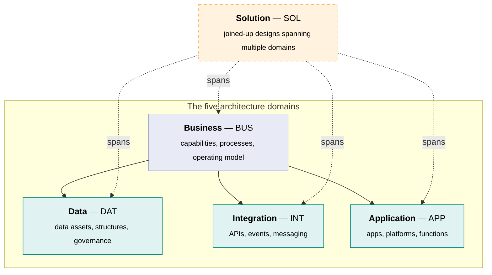

# Architecture Domains

The architecture is organised into five domains. Every artefact type belongs to exactly one domain.

Business sets the context — what the business does and why. Data, Integration, and Application deliver it. Solution architecture cuts across all of them for a specific initiative.

| Architecture Domain | Acronym | Description |
|---|---|---|
| **Business Architecture** | `BUS` | The organisation's capabilities, processes, and operating model — what the business does and why. This domain sets the context that all others serve. |
| **Data Architecture** | `DAT` | The data assets, structures, and governance that support business operations — ensuring data is well-defined, trusted, and available where it is needed. |
| **Integration Architecture** | `INT` | How systems and services connect and communicate — covering APIs, events, messaging, and the rules that govern how information flows between them. |
| **Application Architecture** | `APP` | The software applications and platforms that deliver business capabilities — what exists, how it is organised, and how it relates to business needs. |
| **Solution Architecture** | `SOL` | Joined-up designs that span multiple domains to address a specific business need or initiative — bringing together business, data, integration, and application concerns. |

Artefact IDs are prefixed with the domain acronym (e.g. `BUS-CAP`, `DAT-DAC`, `APP-DAP`).
