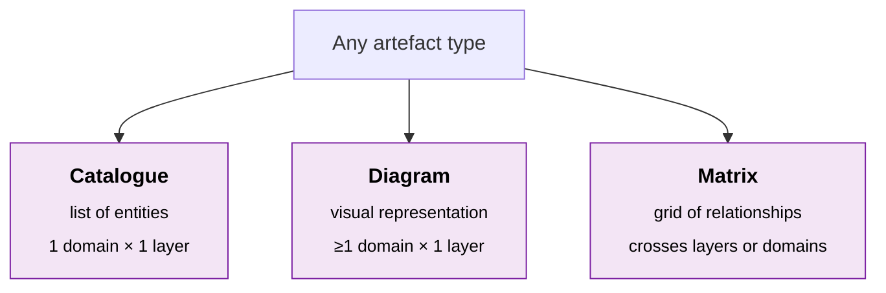

# Output Formats

All architecture artefact types must conform to one of three formats. This keeps outputs consistent, comparable, and machine-queryable.

| Format | Description | Scope |
|---|---|---|
| **Catalogue** | A list of entities of a single type (e.g. applications, capabilities, data entities). Entities may be conceptual, logical, or physical. May be hierarchical — the hierarchy is captured within the catalogue itself. | Single architecture domain, single abstraction layer |
| **Matrix** | A grid expressing relationships between two sets of entities. Used to map links that cross abstraction layers (e.g. conceptual data model → logical data model) or that cross architecture domains (e.g. application architecture → data architecture). | May span architecture domains and/or abstraction layers |
| **Diagram** | A visual representation of entities and their relationships (e.g. Business Capability Model, Conceptual Data Model, System Wiring Diagram). | May span one or more architecture domains, but must be limited to a single abstraction layer |

## Storage

- **Catalogues** are stored as JSON, validated by a JSON Schema in `/schemas/artefacts/domains/<domain>/<layer>/<ID>.json`.
- **Matrices** — format conventions TBD.
- **Diagrams** — format conventions TBD (likely an output of catalogues + matrices rather than authored directly).
