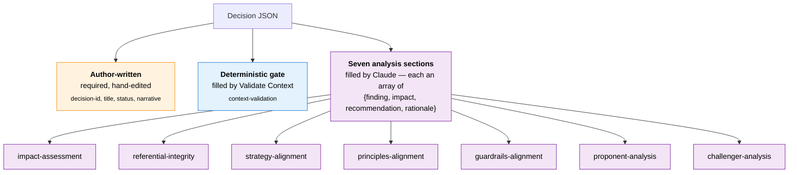

# Decision Record Schema

**File:** [`/config/schemas/decision.json`](../../config/schemas/decision.json)
**Validates:** `/architectures/clients/<client>/<version>/decisions/<decision-id>/decision.json`

## Purpose

Machine-readable Architecture Decision Record. Replaces the prior `adr-<number>.md` convention with a structured JSON file that captures both the author's narrative and the outputs of the eight decision-analysis steps (Validate Context gate + the seven Decisions Analysis jobs). Each step fills in its own section progressively as the decision moves through its lifecycle.

## Structure at a glance

A decision JSON has three zones: author-written metadata, a deterministic gate filled by Validate Context, and seven analysis sections filled by Claude through the decision pipeline.



## Lifecycle

1. **Author** creates `architectures/clients/<client>/<version>/decisions/<decision-id>/decision.json` at branch start, populating `decision-id`, `title`, `status: "draft"`, and `narrative`. This is the only file the author hand-writes for the decision.
2. **Push** to a `decisions/<client-id>/<version-id>/<decision-id>` branch fires `Validate Context` (gate; deterministic: writes `context-validation`).
3. When the author moves the decision from **DRAFT to PROPOSED**, the Pickle API dispatches `Decisions Analysis`, one workflow with seven sequential jobs:
   1. Impact Assessment
   2. Referential Integrity
   3. Strategy Alignment
   4. Principles Alignment
   5. Guardrails Alignment
   6. Proponent Analysis
   7. Challenger Analysis
4. Each analysis job checks out the decisions branch, reads the decision JSON, fills in its own section, commits back with the GITHUB_TOKEN identity, and pushes. The next job runs via `needs:` ordering, one workflow, sequential jobs, no `workflow_run` chaining. See [decisions-analysis.md](../workflows/decisions-analysis.md).

## Section property names match step names

Each step writes to a property whose name is the kebab-cased step name:

| Step | Schema property |
|---|---|
| Validate Context | `context-validation` |
| Impact Assessment | `impact-assessment` |
| Referential Integrity | `referential-integrity` |
| Strategy Alignment | `strategy-alignment` |
| Principles Alignment | `principles-alignment` |
| Guardrails Alignment | `guardrails-alignment` |
| Proponent Analysis | `proponent-analysis` |
| Challenger Analysis | `challenger-analysis` |

## Section shape (seven analyses)

The seven analysis sections: Impact Assessment, Referential Integrity, Strategy Alignment, Principles Alignment, Guardrails Alignment, Proponent Analysis, and Challenger Analysis: are each an **array of findings**. Each finding is an object defined once at `$defs/section` in the schema:

| Field | Type | Required | Description |
|---|---|---|---|
| `finding` | string | yes | What the workflow observed, the analytical output |
| `impact` | string | yes | Why the finding matters: consequence for the proposed change |
| `recommendation` | string | yes | What the author should do in response to the finding |
| `rationale` | string | yes | Why the recommendation is the right course of action |

`additionalProperties: false` on each finding: only the four strings, no metadata. A section can carry a single finding (one-element array) or several distinct findings.

Validate Context is structurally different (deterministic outcome + violation list) and uses its own permissive shape.

## Example

```json
{
    "decision-id": "adr-001",
    "title": "Adopt API-first integration",
    "status": "draft",
    "narrative": "We propose moving all new inter-system traffic to managed APIs. Today...",

    "context-validation": {
        "outcome": "pass",
        "violations": []
    },
    "impact-assessment": [
        {
            "finding": "The proposal will require new artefacts in INT (conceptual and logical) and updates to APP-DAP to capture the API gateway as a platform.",
            "impact": "Without the new INT artefacts, downstream alignment checks cannot reason about the integration shift.",
            "recommendation": "Add INT-STR-001 to the integration strategy and an INT-PRN-NEW principle for API-first.",
            "rationale": "Strategy and principles must be in place before guardrails and physical patterns can be evaluated against them."
        }
    ],
    "referential-integrity": [
        {
            "finding": "Two platform IDs in APP-DAP reference application-domains that do not exist.",
            "impact": "Cross-domain matrices targeting those platforms will be incomplete.",
            "recommendation": "Add the missing application domains or correct the platform domain-id references.",
            "rationale": "Orphaned references silently break catalogue-to-catalogue traceability."
        },
        {
            "finding": "DAT-DAC concept CON-CUSTOMER references domain DOM-ACCOUNT which does not exist in the domains array.",
            "impact": "Customer lookups would fail downstream consumers expecting a valid domain reference.",
            "recommendation": "Either add DOM-ACCOUNT to the data domains or correct the concept's domain-id.",
            "rationale": "Catalogue references must resolve for the data model to be self-consistent."
        }
    ],
    "strategy-alignment":    [ { "finding": "...", "impact": "...", "recommendation": "...", "rationale": "..." } ],
    "principles-alignment":  [ { "finding": "...", "impact": "...", "recommendation": "...", "rationale": "..." } ],
    "guardrails-alignment":  [ { "finding": "...", "impact": "...", "recommendation": "...", "rationale": "..." } ],
    "proponent-analysis":    [ { "finding": "...", "impact": "...", "recommendation": "...", "rationale": "..." } ],
    "challenger-analysis":   [ { "finding": "...", "impact": "...", "recommendation": "...", "rationale": "..." } ]
}
```

## Top-level fields

| Field | Type | Required | Description |
|---|---|---|---|
| `decision-id` | string | yes | Unique identifier in the form `adr-NNN`; must match the parent folder name and the trailing branch segment |
| `title` | string | yes | Short human-readable title |
| `status` | enum | yes | `draft` \| `proposed` \| `accepted` \| `staged` \| `committed` \| `rejected` |
| `narrative` | string | yes | Author's narrative of the proposed change |
| `context-validation` | object | no | Output of Validate Context (permissive object) |
| `impact-assessment` | array of section | no | Output of Impact Assessment |
| `referential-integrity` | array of section | no | Output of Referential Integrity |
| `strategy-alignment` | array of section | no | Output of Strategy Alignment |
| `principles-alignment` | array of section | no | Output of Principles Alignment |
| `guardrails-alignment` | array of section | no | Output of Guardrails Alignment |
| `proponent-analysis` | array of section | no | Output of Proponent Analysis |
| `challenger-analysis` | array of section | no | Output of Challenger Analysis |
