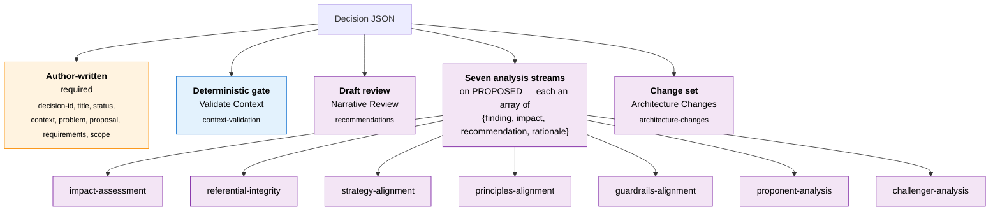

# Decision Record Schema

**File:** [`/config/schemas/decision.json`](../../config/schemas/decision.json)
**Validates:** `/architectures/<architecture>/<transition>/decisions/<decision-id>/decision.json`

## Purpose

Machine-readable Architecture Decision Record. Replaces the prior `adr-<number>.md` convention with a structured JSON file that captures the author's intent (context / problem / proposal + requirements) and the outputs of the decision pipeline — a deterministic context gate, a draft-stage narrative review, seven analysis streams, and the concrete architecture changes. Each step fills in its own property as the decision moves through its lifecycle; the author only hand-writes a small metadata core.

## Structure at a glance

Four zones: author-written intent, a deterministic gate (Validate Context), Claude-written analysis (a draft review + seven proposed-stage streams), and the applied change set.



## Lifecycle

Status flows **DRAFT → PROPOSED → ACCEPTED → STAGED → COMMITTED**, with **REJECTED** as a terminal side-exit. Each transition dispatches work that writes back to the decision JSON:

1. **DRAFT** — the author creates the record with `decision-id`, `title`, `status: "draft"`, and the **context / problem / proposal** narrative (plus optional `requirements` and `scope`). Creation fires **Narrative Review**, which writes plain-language `recommendations` for tightening the narrative and requirements. A push to a `decisions/<architecture-id>/<transition-id>/<decision-id>` branch also fires **Validate Context** (deterministic gate → `context-validation`).
2. **PROPOSED** — dispatches the seven **analysis streams** (each writes its own array): Impact Assessment, Referential Integrity, Strategy Alignment, Principles Alignment, Guardrails Alignment, Proponent Analysis, Challenger Analysis. See [decisions-analysis.md](../workflows/decisions-analysis.md).
3. **ACCEPTED** — dispatches **Architecture Changes**, translating the accepted findings into a discrete, ordered `architecture-changes` list (the edits to apply).
4. **STAGED** — **Apply Changes** edits the actual artefact files on the decision branch and opens a pull request; `pr-number` / `pr-url` are recorded.
5. **COMMITTED** — the PR is merged, closing the loop; the branch is cleaned up.
6. **REJECTED** — terminal; `rejection-reason` is required.

`history` and `activity` accumulate a chronological log of transitions and edits throughout.

## Section property names

Each pipeline step writes to a property named for the step:

| Step | Fires on | Schema property |
|---|---|---|
| Validate Context | branch push | `context-validation` |
| Narrative Review | DRAFT created | `recommendations` |
| Impact Assessment | PROPOSED | `impact-assessment` |
| Referential Integrity | PROPOSED | `referential-integrity` |
| Strategy Alignment | PROPOSED | `strategy-alignment` |
| Principles Alignment | PROPOSED | `principles-alignment` |
| Guardrails Alignment | PROPOSED | `guardrails-alignment` |
| Proponent Analysis | PROPOSED | `proponent-analysis` |
| Challenger Analysis | PROPOSED | `challenger-analysis` |
| Architecture Changes | ACCEPTED | `architecture-changes` |

## Section shape (seven analyses)

The seven analysis streams are each an **array of findings**; each finding is defined once at `$defs/section`:

| Field | Type | Required | Description |
|---|---|---|---|
| `finding` | string | yes | What the stream observed — the analytical output |
| `impact` | string | yes | Why it matters: the consequence for the proposed change |
| `recommendation` | string | yes | What the author should do in response |
| `rationale` | string | yes | Why that is the right course of action |

`additionalProperties: false` — only the four strings. `context-validation` (deterministic outcome + violations), `recommendations` (a list of suggestion objects), and `architecture-changes` (an ordered list of edits) use their own shapes.

## Top-level fields

| Field | Type | Required | Description |
|---|---|---|---|
| `decision-id` | string | yes | Identifier `ADR-NNN` (three digits, uppercase); matches the parent folder and trailing branch segment |
| `title` | string | yes | Short human-readable title |
| `status` | enum | yes | `draft` \| `proposed` \| `accepted` \| `staged` \| `committed` \| `rejected` |
| `context` | string | yes | The current situation prompting the decision |
| `problem` | string | yes | The gap or pain to address |
| `proposal` | string | yes | The proposed direction, at a business level |
| `requirements` | array | no | Structured requirements (ISO 29148): each has title, description, type |
| `scope` | object | no | Narrows automated analysis to a domain / abstraction / artefact |
| `narrative` | string | no | **Deprecated** — composed from context/problem/proposal for downstream workflows; retained for back-compat |
| `rejection-reason` | string | no | Required when `status` is `rejected` |
| `pr-number` / `pr-url` | integer / string | no | The PR opened at STAGED that carries the artefact changes |
| `history` | array | no | Chronological log of status transitions |
| `activity` | array | no | Chronological activity/change log (Created, Updated, …), auto-populated |
| `context-validation` | object | no | Output of Validate Context |
| `recommendations` | array | no | Output of Narrative Review (DRAFT) |
| `impact-assessment` … `challenger-analysis` | array of section | no | Outputs of the seven analysis streams (PROPOSED) |
| `architecture-changes` | array | no | Output of Architecture Changes (ACCEPTED) — the ordered edits |

## Example

```json
{
    "decision-id": "ADR-001",
    "title": "Adopt API-first integration",
    "status": "draft",
    "context": "New inter-system traffic is added ad hoc over point-to-point links.",
    "problem": "Each new integration adds bespoke coupling, slowing delivery and obscuring data lineage.",
    "proposal": "Route all new inter-system traffic through managed APIs behind a gateway.",
    "requirements": [
        { "title": "Managed gateway", "description": "All new interfaces are published via the API gateway.", "type": "constraint" }
    ],
    "scope": { "domain": "integration" },

    "context-validation": { "outcome": "pass", "violations": [] },
    "recommendations": [
        { "recommendation": "State the target latency and throughput the gateway must sustain." }
    ],
    "impact-assessment": [
        {
            "finding": "Requires new INT artefacts and an APP-DAP entry for the gateway platform.",
            "impact": "Alignment checks can't reason about the shift until those artefacts exist.",
            "recommendation": "Add an integration strategy statement and an API-first principle.",
            "rationale": "Strategy and principles must precede guardrail and pattern evaluation."
        }
    ],
    "architecture-changes": [
        {
            "change-type": "create",
            "description": "Add platform PLAT-API-GW to APP-DAP under APP-DOM-INTEGRATION."
        }
    ]
}
```
