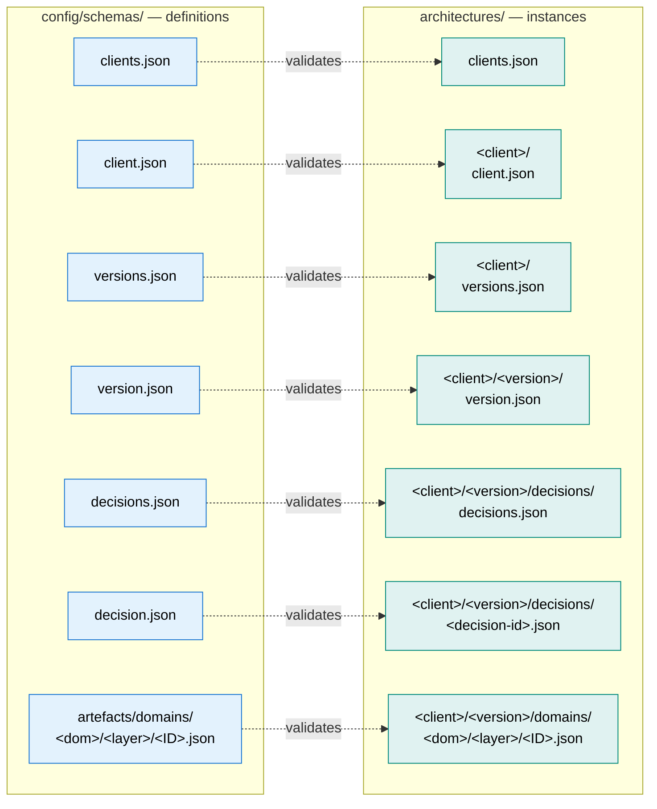

# Schemas

Each schema in [`/config/schemas/`](../../config/schemas/) is documented here. Click through for the structure, what industry standard it draws from, and a domain-specific example.

## Schema / instance mirroring

The `config/schemas/` tree mirrors the `architectures/` tree — every instance file has a schema at the matching relative path.

Each pair below is one row of that mapping. Index files (plural) carry IDs only; the singular metadata files alongside them carry the actual content.

## Index files

| Schema | Documents | Purpose |
|---|---|---|
| [clients.md](clients.md) | `architectures/clients/clients.json` | Authoritative list of client IDs |
| [versions.md](versions.md) | `architectures/clients/<client>/versions.json` | Authoritative list of version IDs for a client |
| [decisions.md](decisions.md) | `architectures/clients/<client>/<version>/decisions/decisions.json` | Authoritative list of decision IDs for a version |
| [artefacts.md](artefacts.md) | `config/schemas/artefacts.json` | Index of all defined catalogue schemas |

## Singular metadata

| Schema | Documents | Purpose |
|---|---|---|
| [client.md](client.md) | `architectures/clients/<client>/client.json` | Per-client metadata (name, description, industry) |
| [version.md](version.md) | `architectures/clients/<client>/<version>/version.json` | Per-version metadata (name, status, description, release-date) |
| [decision.md](decision.md) | `architectures/clients/<client>/<version>/decisions/<decision-id>/decision.json` | Architecture Decision Record (machine-readable) |

## Strategy / Principles / Guardrails (one per architecture domain)

Each architecture domain carries a Strategy (Conceptual), Principles (Logical), and Guardrails (Physical) catalogue. The schemas share their shape across domains; each documentation page below carries a domain-specific example.

| Architecture Domain | Strategy | Principles | Guardrails |
|---|---|---|---|
| Business | [BUS-STR.md](artefacts/domains/business/conceptual/BUS-STR.md) | [BUS-PRN.md](artefacts/domains/business/logical/BUS-PRN.md) | [BUS-GRD.md](artefacts/domains/business/physical/BUS-GRD.md) |
| Data | [DAT-STR.md](artefacts/domains/data/conceptual/DAT-STR.md) | [DAT-PRN.md](artefacts/domains/data/logical/DAT-PRN.md) | [DAT-GRD.md](artefacts/domains/data/physical/DAT-GRD.md) |
| Integration | [INT-STR.md](artefacts/domains/integration/conceptual/INT-STR.md) | [INT-PRN.md](artefacts/domains/integration/logical/INT-PRN.md) | [INT-GRD.md](artefacts/domains/integration/physical/INT-GRD.md) |
| Application | [APP-STR.md](artefacts/domains/application/conceptual/APP-STR.md) | [APP-PRN.md](artefacts/domains/application/logical/APP-PRN.md) | [APP-GRD.md](artefacts/domains/application/physical/APP-GRD.md) |
| Solution | [SOL-STR.md](artefacts/domains/solution/conceptual/SOL-STR.md) | [SOL-PRN.md](artefacts/domains/solution/logical/SOL-PRN.md) | [SOL-GRD.md](artefacts/domains/solution/physical/SOL-GRD.md) |

## Domain-specific catalogue schemas

| Schema | Artefact Type | Architecture Domain / Layer | Aligned to |
|---|---|---|---|
| [BUS-CAP.md](artefacts/domains/business/conceptual/BUS-CAP.md) | Business Capabilities | Business / Conceptual | TOGAF, Business Architecture Guild, CMMI |
| [BUS-PRO.md](artefacts/domains/business/conceptual/BUS-PRO.md) | Business Processes | Business / Conceptual | APQC PCF, Porter value chain |
| [DAT-DAC.md](artefacts/domains/data/conceptual/DAT-DAC.md) | Data Domains & Concepts | Data / Conceptual | DAMA-DMBOK, ISO 27001 |
| [APP-DAP.md](artefacts/domains/application/logical/APP-DAP.md) | Application Domains & Platforms | Application / Logical | TOGAF Application Architecture, Gartner Pace Layers |

## Diagram schemas

Diagram artefacts are derived from a source catalogue rather than authored directly. BUS-BCM and DAT-CDM define a `groups[].items[]` shape rendered by [`NestedGroupDiagram`](../../src/components/artefacts/diagrams/NestedGroupDiagram.jsx) (see [Diagram rendering](#diagram-rendering) below). BUS-BPM and APP-DPM are not yet implemented — their schemas currently define only a `meta` block (including `diagramType`) plus an open `additionalProperties: true` body.

| Schema | Artefact Type | Architecture Domain / Layer | Derived from | Status |
|---|---|---|---|---|
| [BUS-BCM.md](artefacts/domains/business/conceptual/BUS-BCM.md) | Business Capability Model | Business / Conceptual | BUS-CAP | Defined (`card-based`) |
| [BUS-BPM.md](artefacts/domains/business/conceptual/BUS-BPM.md) | Business Process Model | Business / Conceptual | BUS-PRO | Placeholder (`flow-based`) |
| [DAT-CDM.md](artefacts/domains/data/conceptual/DAT-CDM.md) | Conceptual Data Model | Data / Conceptual | DAT-DAC | Defined (`entity-based`) |
| [APP-DPM.md](artefacts/domains/application/logical/APP-DPM.md) | Domains & Platforms Model | Application / Logical | APP-DAP | Placeholder (`card-based`) |

### Diagram rendering

`groups[].items[]` is the shared shape for "grouped card" diagrams (`card-based` and `entity-based` `diagramType`s): each group (e.g. a Level 1 capability or a data domain) is rendered as a card containing its items (e.g. Level 2 sub-capabilities or conceptual data entities). Both groups and items carry an open `meta` object for additional display attributes — e.g. BUS-BCM uses `meta.importance` to badge each capability card. The two diagram types share the same layout component and theme ([`src/lib/diagramTheme.js`](../../src/lib/diagramTheme.js)) and differ only in corner styling.
