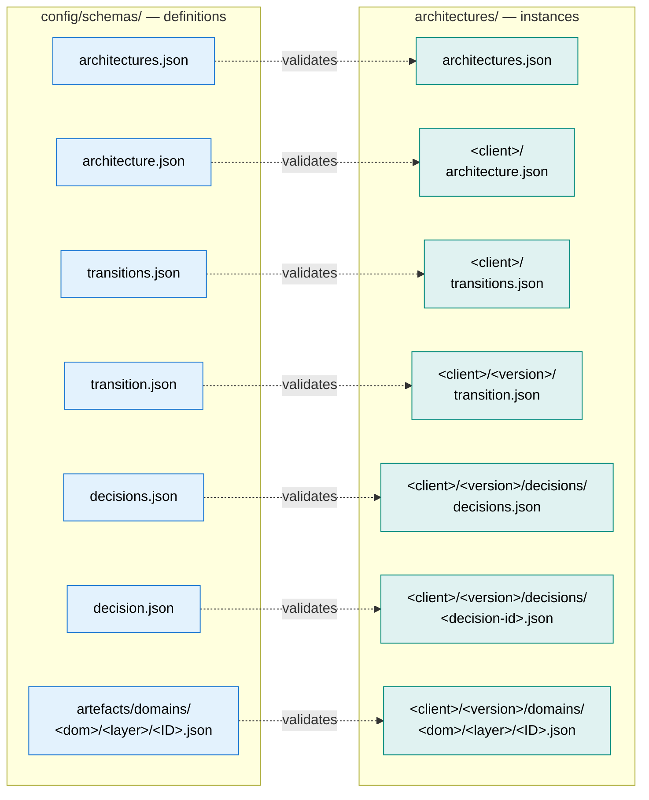

# Schemas

Each schema in [`/config/schemas/`](../../config/schemas/) is documented here. Click through for the structure, what industry standard it draws from, and a domain-specific example.

## Schema / instance mirroring

The `config/schemas/` tree mirrors the `architectures/` tree: every instance file has a schema at the matching relative path.

Each pair below is one row of that mapping. Index files (plural) carry IDs only; the singular metadata files alongside them carry the actual content.

## Index files

| Schema | Documents | Purpose |
|---|---|---|
| [architectures.md](architectures.md) | `architectures/architectures.json` | Authoritative list of architecture IDs |
| [transitions.md](transitions.md) | `architectures/<architecture>/transitions.json` | Authoritative list of transition IDs for an architecture |
| [decisions.md](decisions.md) | `architectures/<architecture>/<transition>/decisions/decisions.json` | Authoritative list of decision IDs for a transition |
| [artefacts.md](artefacts.md) | `config/schemas/artefacts.json` | Index of all defined catalogue schemas |

## Singular metadata

| Schema | Documents | Purpose |
|---|---|---|
| [architecture.md](architecture.md) | `architectures/<architecture>/architecture.json` | Per-architecture metadata (name, description, industry) |
| [transition.md](transition.md) | `architectures/<architecture>/<transition>/transition.json` | Per-transition metadata (name, status, description, release-date) |
| [decision.md](decision.md) | `architectures/<architecture>/<transition>/decisions/<decision-id>/decision.json` | Architecture Decision Record (machine-readable) |

## Strategy / Principles / Guardrails (one per architecture domain)

Each architecture domain carries a Strategy (Conceptual), Principles (Logical), and Guardrails (Physical) catalogue. The schemas share their shape across domains; each documentation page below carries a domain-specific example.

| Architecture Domain | Strategy | Principles | Guardrails |
|---|---|---|---|
| Business | [BUS-STR.md](artefacts/domains/business/conceptual/BUS-STR.md) | [BUS-PRN.md](artefacts/domains/business/logical/BUS-PRN.md) | [BUS-GRD.md](artefacts/domains/business/physical/BUS-GRD.md) |
| Data | [DAT-STR.md](artefacts/domains/data/conceptual/DAT-STR.md) | [DAT-PRN.md](artefacts/domains/data/logical/DAT-PRN.md) | [DAT-GRD.md](artefacts/domains/data/physical/DAT-GRD.md) |
| Integration | [INT-STR.md](artefacts/domains/integration/conceptual/INT-STR.md) | [INT-PRN.md](artefacts/domains/integration/logical/INT-PRN.md) | [INT-GRD.md](artefacts/domains/integration/physical/INT-GRD.md) |
| Application | [APP-STR.md](artefacts/domains/application/conceptual/APP-STR.md) | [APP-PRN.md](artefacts/domains/application/logical/APP-PRN.md) | [APP-GRD.md](artefacts/domains/application/physical/APP-GRD.md) |
| Solution | [SOL-STR.md](artefacts/domains/solution/conceptual/SOL-STR.md) | [SOL-PRN.md](artefacts/domains/solution/logical/SOL-PRN.md) | [SOL-GRD.md](artefacts/domains/solution/physical/SOL-GRD.md) |

## Strategy ↔ Principles / Principles ↔ Guardrails matrices (one pair per architecture domain)

Each architecture domain also carries two many-to-many matrices linking adjacent layers of the Strategy / Principles / Guardrails baseline above: `<DOM>-STR-PRN` (Logical) maps Strategy statements to the Principles that operationalise them, and `<DOM>-PRN-GRD` (Physical) maps Principles to the Guardrails that make them concrete. Both share the `meta.matrix` + sparse `relationships[]` shape described in [artefacts.md](artefacts.md).

| Architecture Domain | Strategy ↔ Principles | Principles ↔ Guardrails |
|---|---|---|
| Business | [BUS-STR-PRN.md](artefacts/domains/business/logical/BUS-STR-PRN.md) | [BUS-PRN-GRD.md](artefacts/domains/business/physical/BUS-PRN-GRD.md) |
| Data | [DAT-STR-PRN.md](artefacts/domains/data/logical/DAT-STR-PRN.md) | [DAT-PRN-GRD.md](artefacts/domains/data/physical/DAT-PRN-GRD.md) |
| Integration | [INT-STR-PRN.md](artefacts/domains/integration/logical/INT-STR-PRN.md) | [INT-PRN-GRD.md](artefacts/domains/integration/physical/INT-PRN-GRD.md) |
| Application | [APP-STR-PRN.md](artefacts/domains/application/logical/APP-STR-PRN.md) | [APP-PRN-GRD.md](artefacts/domains/application/physical/APP-PRN-GRD.md) |
| Solution | [SOL-STR-PRN.md](artefacts/domains/solution/logical/SOL-STR-PRN.md) | [SOL-PRN-GRD.md](artefacts/domains/solution/physical/SOL-PRN-GRD.md) |

## Domain-specific catalogue schemas

| Schema | Artefact Type | Architecture Domain / Layer | Aligned to |
|---|---|---|---|
| [BUS-CAP.md](artefacts/domains/business/conceptual/BUS-CAP.md) | Business Capabilities | Business / Conceptual | TOGAF, Business Architecture Guild, CMMI |
| [BUS-PRO.md](artefacts/domains/business/conceptual/BUS-PRO.md) | Business Processes | Business / Conceptual | APQC PCF, Porter value chain |
| [DAT-DAC.md](artefacts/domains/data/conceptual/DAT-DAC.md) | Data Domains & Concepts | Data / Conceptual | DAMA-DMBOK, ISO 27001 |
| [APP-DAP.md](artefacts/domains/application/logical/APP-DAP.md) | Application Domains & Platforms | Application / Logical | TOGAF Application Architecture, Gartner Pace Layers |
| [APP-CAT.md](artefacts/domains/application/physical/APP-CAT.md) | Application Catalogue | Application / Physical | Application Portfolio Management (TIME model), ITAM |
| [INT-IFC.md](artefacts/domains/integration/logical/INT-IFC.md) | Interface Catalogue | Integration / Logical | TOGAF Integration/Application Communication Diagrams, C4 System Context |
| [BUS-CAP-PRO.md](artefacts/domains/business/conceptual/BUS-CAP-PRO.md) | Business Capabilities ↔ Business Processes | Business / Conceptual | APQC PCF, TOGAF capability mapping |

## Cross-domain / cross-layer matrices

Beyond the per-domain Strategy ↔ Principles / Principles ↔ Guardrails pairs above, matrices can also join two artefacts from different domains and/or abstraction layers. The domain/layer the matrix lives in, and which source becomes `columns` vs `rows`, follow the [Matrix placement](../output-formats.md#matrix-placement) convention.

| Schema | Artefact Type | Architecture Domain / Layer | Joins |
|---|---|---|---|
| [APP-DAP-CAT.md](artefacts/domains/application/physical/APP-DAP-CAT.md) | Application Domains & Platforms ↔ Application Catalogue | Application / Physical | APP-DAP ↔ APP-CAT |
| [APP-CAP-DAP.md](artefacts/domains/application/logical/APP-CAP-DAP.md) | Business Capabilities ↔ Application Domains & Platforms | Application / Logical | BUS-CAP (Level 2) ↔ APP-DAP |
| [INT-DAC-IFC.md](artefacts/domains/integration/logical/INT-DAC-IFC.md) | Data Domains & Concepts ↔ Interface Catalogue | Integration / Logical | DAT-DAC ↔ INT-IFC |

## Diagram schemas

Diagram artefacts are derived from a source catalogue rather than authored directly. Valid `diagramType` values and their renderers are defined in [output-formats.md](../output-formats.md#diagram-types).

| Schema | Artefact Type | Architecture Domain / Layer | Derived from | `diagramType` |
|---|---|---|---|---|
| [BUS-BCM.md](artefacts/domains/business/conceptual/BUS-BCM.md) | Business Capability Model | Business / Conceptual | BUS-CAP | `card-based` |
| [BUS-BPM.md](artefacts/domains/business/conceptual/BUS-BPM.md) | Business Process Model | Business / Conceptual | BUS-PRO | `card-based` (groups/items/subitems) |
| [DAT-CDM.md](artefacts/domains/data/conceptual/DAT-CDM.md) | Conceptual Data Model | Data / Conceptual | DAT-DAC | `entity-based` |
| [APP-DPM.md](artefacts/domains/application/logical/APP-DPM.md) | Domains & Platforms Model | Application / Logical | APP-DAP | `card-based` |
| [INT-WRD.md](artefacts/domains/integration/logical/INT-WRD.md) | Interface Wiring Diagram | Integration / Logical | INT-IFC + APP-DAP | `wiring` |

### Diagram rendering

`groups[].items[]` is the shared shape for "grouped card" diagrams (`card-based` and `entity-based` `diagramType`s): each group is rendered as a card containing its items. Groups and items carry an open `meta` object for additional display attributes: e.g. BUS-BCM uses `meta.importance` to badge each capability card. The `wiring` type (`INT-WRD`) derives its data from INT-IFC and APP-DAP at render time: no authored data in the instance file.

## Document schemas

Document artefacts contain a `documents` array: each element is a named instance (e.g. one Architecture Vision per programme). See [output-formats.md](../output-formats.md#document-sections) for the section structure of each type.

| Schema | Artefact Type | Architecture Domain / Layer |
|---|---|---|
| [SOL-AVI.md](artefacts/domains/solution/conceptual/SOL-AVI.md) | Architecture Vision(s) | Solution / Conceptual |
| [SOL-AIN.md](artefacts/domains/solution/conceptual/SOL-AIN.md) | Architecture Intent(s) | Solution / Conceptual |
| [SOL-SVI.md](artefacts/domains/solution/logical/SOL-SVI.md) | Solution Intent(s) | Solution / Logical |
| [SOL-SDE.md](artefacts/domains/solution/logical/SOL-SDE.md) | Solution Design(s) | Solution / Logical |
| [SOL-ISP.md](artefacts/domains/solution/physical/SOL-ISP.md) | Interface Specification(s) | Solution / Physical |
