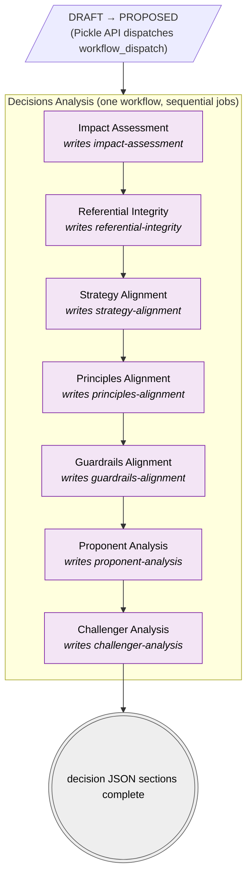

# Decisions Analysis

**Files:**
- Orchestrator: [`/.github/workflows/decisions-analysis.yml`](../../.github/workflows/decisions-analysis.yml)
- Reusable analysis step: [`/.github/workflows/decisions-analysis-step.yml`](../../.github/workflows/decisions-analysis-step.yml)

**Trigger:** `workflow_dispatch`, called by the Pickle API ([`/api/github`](../../src/api/github.js)) when a decision's status moves DRAFT → PROPOSED.

A single workflow runs seven Claude-driven analyses sequentially as `needs:`-chained jobs. Each analysis writes to the matching kebab-cased section of the [decision JSON](../schemas/decision.md) at `architectures/<architecture>/<transition>/decisions/<decision-id>/decision.json`, on the decision's own branch (`decisions/<architecture>/<transition>/<decision-id>`): in-flight decisions live on their branch, not `main`.

Narrative Review ([`decisions-narrative-review.yml`](../../.github/workflows/decisions-narrative-review.yml)) is a separate workflow that runs once, on DRAFT creation, writing to the `recommendations` section. It is not part of this chain.

## Pre-requisites

1. The **author** creates the decision JSON at branch start (via the Pickle UI), populating `decision-id`, `title`, `status: "draft"`, `narrative`, and optionally `requirements`. The analysis steps read this file, it must already exist on the decisions branch.
2. The Claude API key must be set as the `ANTHROPIC_API_KEY` repository secret. Without it, every analysis job fails at the "Run Claude analysis" step.

## Why a single workflow with sequential jobs?

`workflow_run` chaining is **capped at three hops** by GitHub Actions: any workflow more than three links downstream of the initiating event silently never fires. Collapsing the seven analyses into one workflow with `needs:` dependencies sidesteps the limit entirely, since the orchestrator is invoked directly via `workflow_dispatch`. The whole run shows up as one entry on the Actions tab with each analysis as a job, which is also easier to read than chasing seven separate runs across the UI.

## Chain mechanism

- Each job declares `needs:` on the previous job; if a job fails, downstream jobs cascade-skip.
- Each job calls the reusable [`decisions-analysis-step.yml`](../../.github/workflows/decisions-analysis-step.yml), parameterised by `analysis-name`, `prompt-file`, `section-key`, `client-id`, `version-id`, `decision-id`, and `model`.
- Inside the step: checks out the decisions branch, runs `anthropics/claude-code-base-action@beta` with the prompt loaded from [`/config/prompts/decisions/`](../../config/prompts/decisions/), writes the result into the matching `section-key` of the decision JSON, and pushes the commit back to the decisions branch via `GITHUB_TOKEN`.

## Model selection

Every step accepts a `model` input, defaulting to **Haiku 4.5** (`claude-haiku-4-5-20251001`) to keep dev-time cost down. The orchestrator's `workflow_dispatch` exposes a single `model` input that's threaded through to all seven jobs: pass a different model (e.g. `claude-sonnet-4-6`) for a higher-quality run.

> **Future:** model (and API key) selection is currently global to the repo. A planned improvement is to store the model/key per client alongside their other configuration, so different clients' architectures can be analysed with different Claude models: see `BACKLOG.md`.

## Visual flow

| | Step type |
|---|---|
| 🟪 Purple | Claude-driven: loads its prompt from `/config/prompts/decisions/<step>.md` |
| ⬜ Grey | Terminal: pipeline exit |

## The seven analysis jobs

Each job calls `decisions-analysis-step.yml` with three inputs that vary (plus the shared `client-id`/`version-id`/`decision-id`/`model`):

| # | Job | Prompt file | Decision-JSON section | Purpose |
|---|---|---|---|---|
| 1 | `impact-assessment` | `config/prompts/decisions/architecture-review.md` | `impact-assessment` | Identify which artefact types and catalogue entries are affected by the decision. |
| 2 | `referential-integrity` | `config/prompts/decisions/referential-integrity.md` | `referential-integrity` | Verify that all catalogue IDs referenced resolve and no entities are orphaned. |
| 3 | `strategy-alignment` | `config/prompts/decisions/strategy-alignment.md` | `strategy-alignment` | Assess whether the decision advances or contradicts the documented Strategy for each affected domain. |
| 4 | `principles-alignment` | `config/prompts/decisions/principles-alignment.md` | `principles-alignment` | Assess whether the decision adheres to or violates the Principles for each affected domain. |
| 5 | `guardrails-alignment` | `config/prompts/decisions/guardrails-alignment.md` | `guardrails-alignment` | Assess whether the decision complies with or breaches the non-negotiable Guardrails for each affected domain. |
| 6 | `proponent-analysis` | `config/prompts/decisions/proponent-analysis.md` | `proponent-analysis` | Synthesise the strongest business case FOR the change from the upstream findings. |
| 7 | `challenger-analysis` | `config/prompts/decisions/challenger-analysis.md` | `challenger-analysis` | Synthesise the strongest business case AGAINST the change from the upstream findings. |

Iterate prompt content in `/config/prompts/decisions/` without touching the workflow YAML; each file is loaded at runtime. Each section is an array of `{finding, impact, recommendation, rationale}` objects: see [decision.md](../schemas/decision.md#section-shape).

## Re-running a single step

Because each step is a job (not a separate workflow), the Actions UI re-run-failed-jobs option will pick up from the first failed/skipped job. Re-running the whole workflow re-runs all seven analyses.
