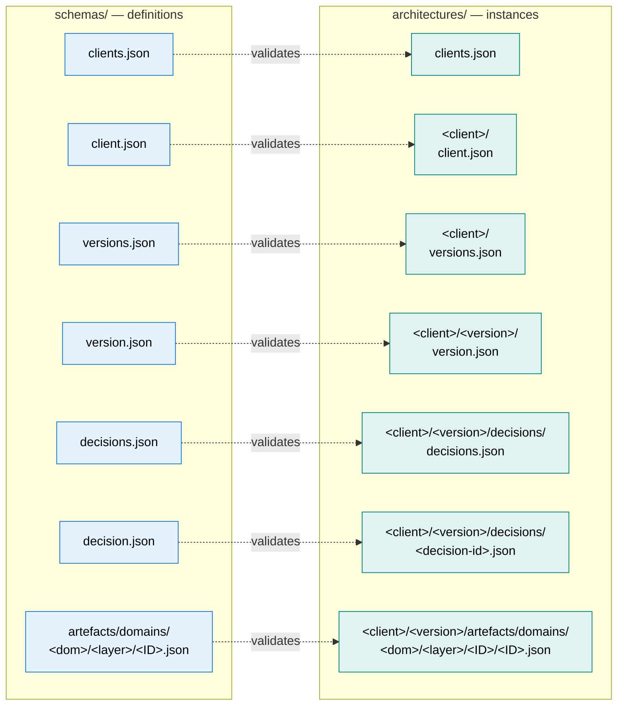

# Schemas

Each schema in [`/schemas/`](../../schemas/) is documented here. Click through for the structure, what industry standard it draws from, and a domain-specific example.

## Schema / instance mirroring

The `schemas/` tree mirrors the `architectures/` tree — every instance file has a schema at the matching relative path.

Each pair below is one row of that mapping. Index files (plural) carry IDs only; the singular metadata files alongside them carry the actual content.

## Index files

| Schema | Documents | Purpose |
|---|---|---|
| [clients.md](clients.md) | `architectures/clients.json` | Authoritative list of client IDs |
| [versions.md](versions.md) | `architectures/<client>/versions.json` | Authoritative list of version IDs for a client |
| [decisions.md](decisions.md) | `architectures/<client>/<version>/decisions/decisions.json` | Authoritative list of decision IDs for a version |
| [artefacts.md](artefacts.md) | `schemas/artefacts.json` | Index of all defined catalogue schemas |

## Singular metadata

| Schema | Documents | Purpose |
|---|---|---|
| [client.md](client.md) | `architectures/<client>/client.json` | Per-client metadata (name, etc.) |
| [version.md](version.md) | `architectures/<client>/<version>/version.json` | Per-version metadata (name, status) |
| [decision.md](decision.md) | `architectures/<client>/<version>/decisions/<decision-id>.json` | Architecture Decision Record (machine-readable) |

## Strategy / Principles / Guardrails (one per architecture domain)

Each architecture domain carries a Strategy (Conceptual), Principles (Logical), and Guardrails (Physical) catalogue. The schemas share their shape across domains; each documentation page below carries a domain-specific example.

| Architecture Domain | Strategy | Principles | Guardrails |
|---|---|---|---|
| Business | [BUS-STR.md](BUS-STR.md) | [BUS-PRN.md](BUS-PRN.md) | [BUS-GRD.md](BUS-GRD.md) |
| Data | [DAT-STR.md](DAT-STR.md) | [DAT-PRN.md](DAT-PRN.md) | [DAT-GRD.md](DAT-GRD.md) |
| Integration | [INT-STR.md](INT-STR.md) | [INT-PRN.md](INT-PRN.md) | [INT-GRD.md](INT-GRD.md) |
| Application | [APP-STR.md](APP-STR.md) | [APP-PRN.md](APP-PRN.md) | [APP-GRD.md](APP-GRD.md) |
| Solution | [SOL-STR.md](SOL-STR.md) | [SOL-PRN.md](SOL-PRN.md) | [SOL-GRD.md](SOL-GRD.md) |

## Domain-specific catalogue schemas

| Schema | Artefact Type | Architecture Domain / Layer | Aligned to |
|---|---|---|---|
| [BUS-CAP.md](BUS-CAP.md) | Business Capabilities | Business / Conceptual | TOGAF, Business Architecture Guild, CMMI |
| [BUS-PRO.md](BUS-PRO.md) | Business Processes | Business / Conceptual | APQC PCF, Porter value chain |
| [DAT-DAC.md](DAT-DAC.md) | Data Domains & Concepts | Data / Conceptual | DAMA-DMBOK, ISO 27001 |
| [APP-DAP.md](APP-DAP.md) | Application Domains & Platforms | Application / Logical | TOGAF Application Architecture, Gartner Pace Layers |
