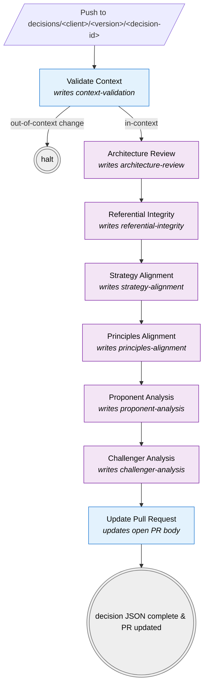

# Decision Pipeline

Six analysis workflows that run in sequence after [Validate Context](validate-context.md) passes on a `decisions/<client>/<version>/<decision-id>` branch push. Each fills in a section of the [decision JSON](../schemas/decision.md) at `architectures/clients/<client>/<version>/decisions/<decision-id>/decision.json`. **Schema property names match the kebab-cased workflow names** — e.g., the `Architecture Review` workflow writes to the `architecture-review` property.

## Pre-requisites

1. The **author** hand-creates the decision JSON at branch start, populating `decision-id`, `title`, `status: "draft"`, and `narrative`. The seven workflows refuse to run if the decision file is missing.
2. **Validate Context** (`validate-context.yml`) runs first on the push and gates the pipeline. If it fails (out-of-context file changes), the chain below does not run.

## Chain mechanism

- Validate Context is the trigger workflow — it runs on `push` to `decisions/**`.
- The six analysis workflows below are triggered by `workflow_run` on the prior workflow's successful completion.
- Each workflow checks out the decision branch, invokes `anthropics/claude-code-base-action@beta` with the prompt loaded from [`/prompts/decisions/`](../../prompts/decisions/), then commits the updated decision JSON back via `GITHUB_TOKEN`. The commit push does **not** re-trigger push events (GitHub anti-recursion), so the chain is linear and finite.
- The Claude API key is read from the `ANTHROPIC_API_KEY` repository secret. Without that secret configured, the analysis steps fail at the Claude action call.

> **`workflow_run` only fires from workflow files on the default branch.** The chain is dormant until these workflows reach `main`.

## Visual flow

| | Workflow type |
|---|---|
| 🟦 Blue | Deterministic — runs without Claude |
| 🟪 Purple | Claude-driven — loads its prompt from `/prompts/decisions/<workflow>.md` |
| ⬜ Grey | Terminal — pipeline exit |

A failure (or skip) at any step halts everything downstream, because each link uses `workflow_run` with `if: github.event.workflow_run.conclusion == 'success'`.

## The six analysis workflows

### 1. Architecture Review
- **File:** `decisions-architecture-review.yml`
- **Trigger:** `workflow_run` after Validate Context
- **Will eventually do:** take the narrative; recommend the artefact-type changes that ought to be made.
- **Section written:** `architecture-review`

### 2. Referential Integrity
- **File:** `decisions-referential-integrity.yml`
- **Trigger:** `workflow_run` after Architecture Review
- **Will eventually do:** check IDs align, no orphans (especially across matrix content); recommend updates to the ADR.
- **Section written:** `referential-integrity`

### 3. Strategy Alignment
- **File:** `decisions-strategy-alignment.yml`
- **Trigger:** `workflow_run` after Referential Integrity
- **Will eventually do:** if Conceptual artefacts are changing, review against the Strategy for the affected domain; recommend ADR updates.
- **Section written:** `strategy-alignment`

### 4. Principles Alignment
- **File:** `decisions-principles-alignment.yml`
- **Trigger:** `workflow_run` after Strategy Alignment
- **Will eventually do:** if Logical artefacts are changing, review against the Principles for the affected domain; recommend ADR updates.
- **Section written:** `principles-alignment`

### 5. Proponent Analysis
- **File:** `decisions-proponent-analysis.yml`
- **Trigger:** `workflow_run` after Principles Alignment
- **Will eventually do:** read the outputs from Referential Integrity, Strategy Alignment, Principles Alignment, and produce a narrative arguing FOR the change.
- **Section written:** `proponent-analysis`

### 6. Challenger Analysis
- **File:** `decisions-challenger-analysis.yml`
- **Trigger:** `workflow_run` after Proponent Analysis
- **Will eventually do:** read the same upstream outputs and produce a narrative arguing AGAINST the change.
- **Section written:** `challenger-analysis`

### 7. Update Pull Request (closing link)
- **File:** `decisions-update-pull-request.yml`
- **Trigger:** `workflow_run` after Challenger Analysis
- **What it does:** formats the now-populated decision JSON into markdown and replaces the open PR's description so reviewers see the narrative + all seven analysis sections without opening the JSON.
- See [decisions-update-pull-request.md](decisions-update-pull-request.md) for details.

## Current status

All six analysis workflows are now **Claude-driven** end to end:

- Each loads its prompt from [`/prompts/decisions/<workflow>.md`](../../prompts/decisions/).
- Claude reads the decision JSON, follows the prompt, and writes the four-string `{finding, impact, recommendation, rationale}` shape into the matching section.
- The workflow commits the updated decision JSON back to the branch.

The **prompts themselves are stubs** — they describe the role and output contract but the task descriptions are placeholders. Iterate the prompt content in `/prompts/decisions/` without touching the workflow YAML; the file is loaded at runtime.

[Validate Context](validate-context.md) and [Update Pull Request](decisions-update-pull-request.md) are the deterministic links in the chain — they bookend the Claude-driven analysis and do not call Claude themselves.
