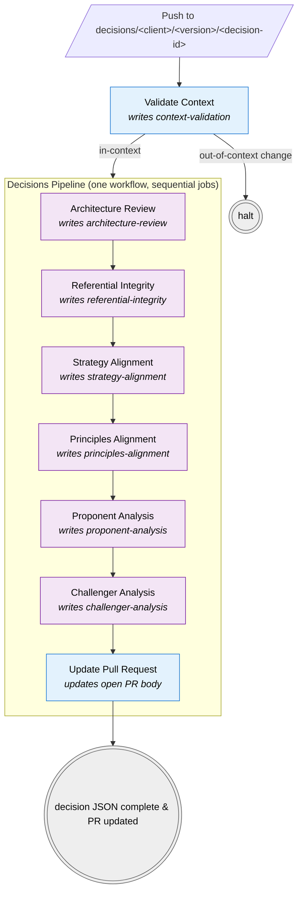

# Decisions Pipeline

**Files:**
- Orchestrator: [`/.github/workflows/decisions-pipeline.yml`](../../.github/workflows/decisions-pipeline.yml)
- Reusable analysis step: [`/.github/workflows/decisions-analysis-step.yml`](../../.github/workflows/decisions-analysis-step.yml)
- PR-body formatter: [`/.github/scripts/format-decision-for-pr.py`](../../.github/scripts/format-decision-for-pr.py)

**Trigger:** `workflow_run` after [Validate Context](validate-context.md) completes on a `decisions/**` branch.

A single workflow runs six Claude-driven analyses sequentially as `needs:`-chained jobs, then updates the open PR body. Each analysis writes to the matching kebab-cased section of the [decision JSON](../schemas/decision.md) at `architectures/clients/<client>/<version>/decisions/<decision-id>/decision.json`.

## Pre-requisites

1. The **author** hand-creates the decision JSON at branch start, populating `decision-id`, `title`, `status: "draft"`, and `narrative`. The analysis jobs refuse to run if the decision file is missing.
2. **Validate Context** runs first on the push and gates the pipeline. If it fails (out-of-context file changes), the pipeline does not run.
3. The Claude API key must be set as the `ANTHROPIC_API_KEY` repository secret. Without it the analysis jobs fail at the Claude action call.

## Why a single workflow with sequential jobs?

`workflow_run` chaining is **capped at three hops** by GitHub Actions — any workflow more than three links downstream of the initiating event silently never fires. The pipeline has seven steps (six analyses + PR update), which is more than the limit allows.

Collapsing them into one workflow with `needs:` dependencies sidesteps the limit. The whole pipeline shows up as one run on the Actions tab with each step as a job, which is also easier to read than chasing seven separate runs across the UI.

## Chain mechanism

- The orchestrator listens for `workflow_run` of Validate Context (one hop — well inside the limit).
- The first job (`architecture-review`) is guarded by `if: github.event.workflow_run.conclusion == 'success' && startsWith(...head_branch, 'decisions/')` so the pipeline is a no-op for non-decision branches or failed gates.
- Each subsequent job declares `needs:` on the previous job; if any job fails or is skipped, downstream jobs cascade-skip.
- The six analysis jobs each invoke the reusable `decisions-analysis-step.yml` workflow, parameterised by `analysis-name`, `prompt-file`, `section-key`, and `branch`. Inside, the step checks out the branch, calls `anthropics/claude-code-base-action@beta` with the prompt loaded from [`/prompts/decisions/`](../../prompts/decisions/), writes the result into the decision JSON, and pushes the commit back via `GITHUB_TOKEN`.
- The final `update-pull-request` job is inlined (different shape — it formats the JSON and edits the PR body rather than calling Claude).

## Visual flow

| | Step type |
|---|---|
| 🟦 Blue | Deterministic — runs without Claude |
| 🟪 Purple | Claude-driven — loads its prompt from `/prompts/decisions/<step>.md` |
| ⬜ Grey | Terminal — pipeline exit |

## The six analysis jobs

Each analysis job is a call into `decisions-analysis-step.yml` with three inputs that vary:

| # | Job | Prompt file | Decision-JSON section | Will eventually do |
|---|---|---|---|---|
| 1 | `architecture-review` | `prompts/decisions/architecture-review.md` | `architecture-review` | Take the narrative; recommend the artefact-type changes that ought to be made. |
| 2 | `referential-integrity` | `prompts/decisions/referential-integrity.md` | `referential-integrity` | Check IDs align, no orphans (especially across matrix content); recommend updates to the ADR. |
| 3 | `strategy-alignment` | `prompts/decisions/strategy-alignment.md` | `strategy-alignment` | If Conceptual artefacts are changing, review against the Strategy for the affected domain; recommend ADR updates. |
| 4 | `principles-alignment` | `prompts/decisions/principles-alignment.md` | `principles-alignment` | If Logical artefacts are changing, review against the Principles for the affected domain; recommend ADR updates. |
| 5 | `proponent-analysis` | `prompts/decisions/proponent-analysis.md` | `proponent-analysis` | Read the outputs from Referential Integrity, Strategy Alignment, Principles Alignment, and produce a narrative arguing FOR the change. |
| 6 | `challenger-analysis` | `prompts/decisions/challenger-analysis.md` | `challenger-analysis` | Read the same upstream outputs and produce a narrative arguing AGAINST the change. |

The **prompts themselves are stubs** — they describe the role and output contract but the task descriptions are placeholders. Iterate the prompt content in `/prompts/decisions/` without touching the workflow YAML; the file is loaded at runtime.

## The closing job — Update Pull Request

The final `update-pull-request` job:

1. Checks out the decision branch (now carrying every analysis commit).
2. Reads the decision JSON.
3. Runs `format-decision-for-pr.py` to render it as markdown: title, ID, status, narrative, then each analysis section (multiple findings rendered as numbered sub-blocks).
4. Looks up the open PR for the branch via `gh pr list --head <branch>`.
5. If a PR is open, replaces its description with the formatted markdown via `gh pr edit --body-file`. If no PR is open, exits with a notice (no error).

Notes:

- It runs once at the end of the chain, not after every intermediate commit — each upstream commit is superseded by the next, so the PR only needs updating once.
- If any earlier job fails, this job does not run. The PR description stays at whatever `Create Pull Request` produced (stub).
- The replacement is full: any previous description content (including the stub from `Create Pull Request`) is overwritten. The footer line `_Auto-generated by the Update Pull Request workflow…_` signals the source.
- Uses the default `GITHUB_TOKEN`, with `pull-requests: write` permission set at the workflow level.
- Requires the repo setting *"Allow GitHub Actions to create and approve pull requests"* — same setting `Create Pull Request` already needs.

## Re-running a single step

Because each step is a job (not a separate workflow), the Actions UI re-run-failed-jobs option will pick up from the first failed/skipped job. Re-running the whole workflow re-runs all six analyses plus the PR update.
